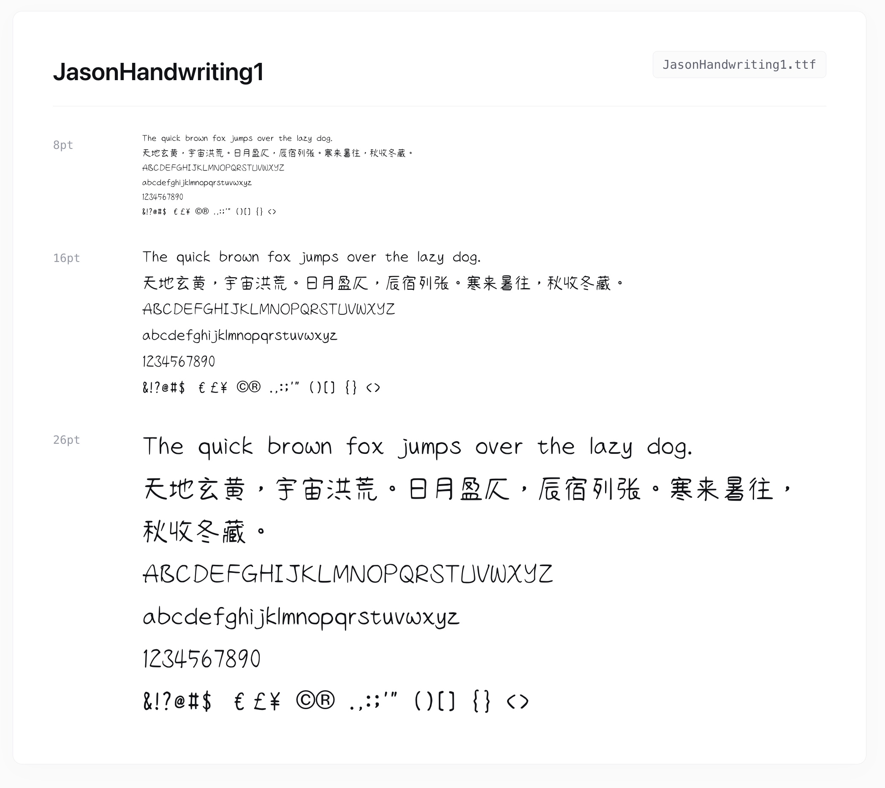

# Font Preview Generator

**HTML font previews** for local `.ttf`, `.otf`, `.woff`, and `.woff2` fonts — **without installing them** on your system.

Recursively scans a folder, groups fonts by true family name (uses python [**`fontTools`**](https://github.com/fonttools/fonttools)), deduplicates variants, embeds multiple source formats per family, and renders a preview page with pangram + multilingual test text at multiple sizes. Opens the result in your default browser.



## Features

- Zero font installation required — works directly from font files.
- Smart family-name extraction (prefers OpenType Preferred Family).
- Aggregates all formats of the same family into one card.
- Prioritizes WOFF2 > WOFF > TTF/OTF for web preview.
- Customizable sample text.

## Prerequisites

- **Python 3.8+**
- `fonttools` (with brotli support for WOFF2)

## Installation

### 1. Clone the repo

```bash
git clone https://github.com/glowinthedark/font-preview-generator.git
cd font-preview-generator
```

**README.md**

```markdown
# Font Preview Generator

**Generate beautiful, self-contained HTML typography specimen sheets** for local `.ttf`, `.otf`, `.woff`, and `.woff2` fonts — **without installing them** on your system.

Recursively scans a folder, groups fonts by true family name (via `fontTools`), deduplicates variants, embeds multiple source formats per family, and renders a clean, responsive preview page with pangram + multilingual test text at multiple sizes. Opens the result in your default browser instantly.


*Screenshot: Clean specimen output with family grouping, multiple sizes, and embedded metadata.*

## Features

- Zero font installation required — works directly from font files.
- Smart family-name extraction (prefers OpenType Preferred Family).
- Aggregates all formats of the same family into one card.
- Prioritizes WOFF2 > WOFF > TTF/OTF for web preview.
- Responsive, elegant UI using golden-ratio proportions.
- Customizable sample text.
- Lightweight, pure Python (single script).

## Prerequisites

- **Python 3.8+**
- `fonttools` (with brotli support for WOFF2)

## Installation

### 1. Clone the repo

```bash
git clone https://github.com/glowinthedark/font-preview-generator.git
cd font-preview-generator
```

### 2. Install dependencies

**Recommended (uv):**

```bash
# with venv
uv pip install fonttools brotli

# no venv, system-wide
uv pip install --system --break-system-packages fonttools brotli
```

**Or pip:**

```bash
pip install fonttools brotli
```

## Usage

### Basic

```bash
python3 font_prevew_generator.py
```

Scans the current directory and generates `preview.html`.

### Custom folder

```bash
python font_prevew_generator.py /path/to/fonts
```

### Custom preview text

```bash
python font_prevew_generator.py --text "Lorem ipsum dolor sit amet"
```

## How It Works

1. Recursively finds all supported font files.
2. Extracts family name via `TTFont` name table (ID 16 → ID 1 fallback).
3. Groups by family, selecting optimal format for `@font-face`.
4. Embeds all sibling filenames for reference.
5. Renders responsive cards with 12pt/16pt/26pt specimens.
6. Writes `preview.html` + auto-opens in browser.

## Output Example

A single clean `preview.html` file with:
- Header summary (total files & unique families).
- Per-family cards with metadata.
- Multiple test sizes + pangram + Latin/CJK/glyphs.

## License

AGPLv3 — see [LICENSE](LICENSE).

